# 🏥 SEHAT — Smart Edge Healthcare Access & Telemedicine Platform

> **Smart India Hackathon 2026 — Problem Statement 26133 (Government of Maharashtra)**  
> *Empowering ASHA, ANM, and CHO Healthcare Workers with Offline-First, Multilingual Digital Triage and Telemedicine.*

---

[](https://www.android.com/)
[](https://kotlinlang.org/)
[](https://developer.android.com/jetpack/compose)
[](https://m3.material.io/)
[](https://developer.android.com/training/data-storage/room)
[](https://gradle.org/)

---

## 📌 Project Overview

**SEHAT** (Smart Edge Healthcare Access & Telemedicine Platform) is a state-of-the-art, offline-first mobile platform designed for Maharashtra's rural public healthcare network. Built specifically for frontline health workers (**ASHA Workers, ANMs, and CHOs**), SEHAT bridges rural communities with Primary Health Centers (PHC), Community Health Centers (CHC), and District Hospitals.

The platform provides offline clinical screening, AI-driven digital triage, ABHA-linked longitudinal health records, automated facility appointments, emergency escalation, and real-time voice interactions in **Marathi, Hindi, and English**.

---

## 📱 Screenshots

| | | | |
| :---: | :---: | :---: | :---: |
| 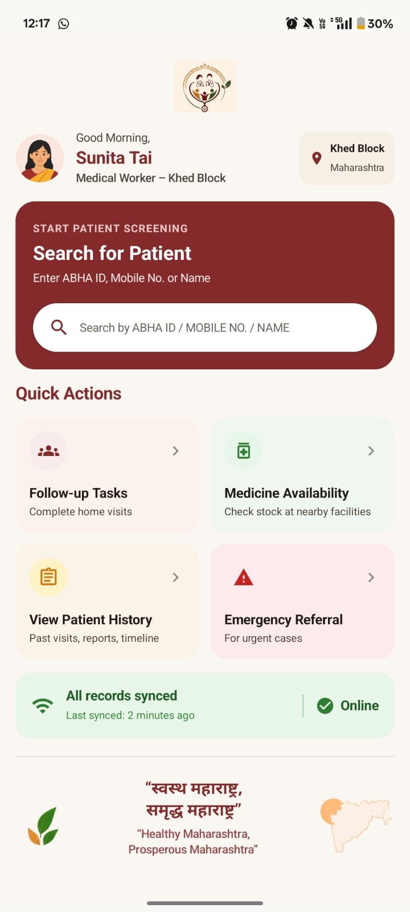 | 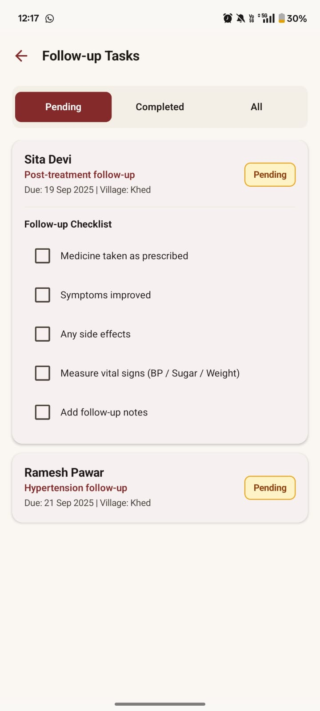 | 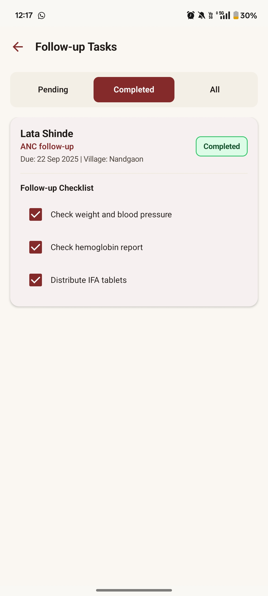 | 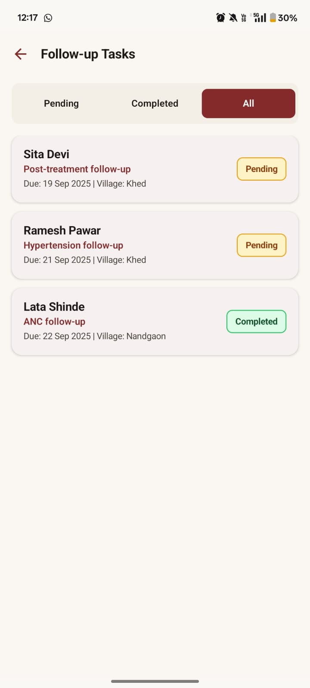 |
| 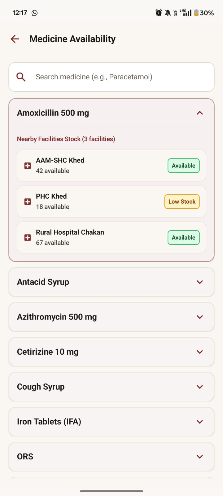 |  | 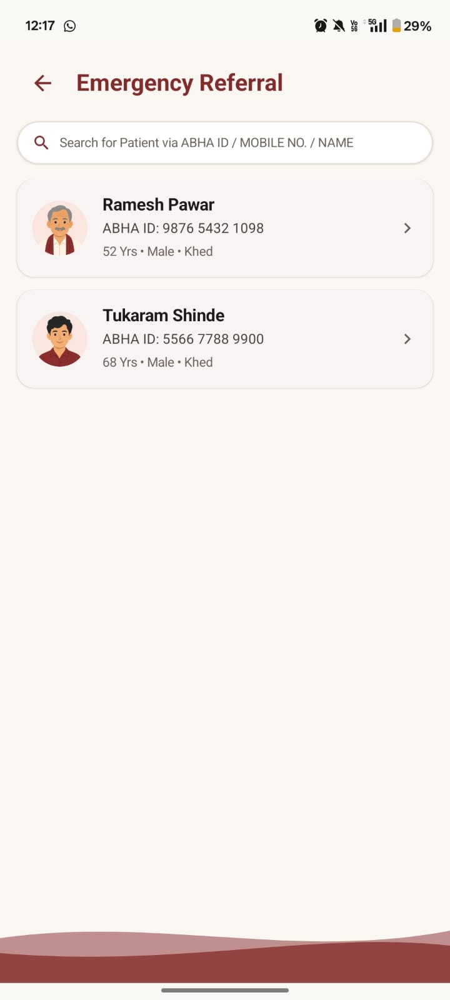 | 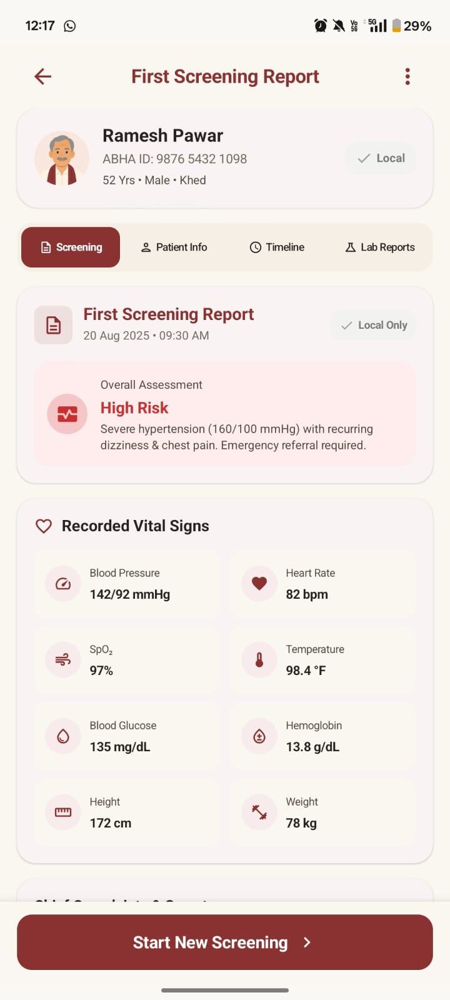 |
| 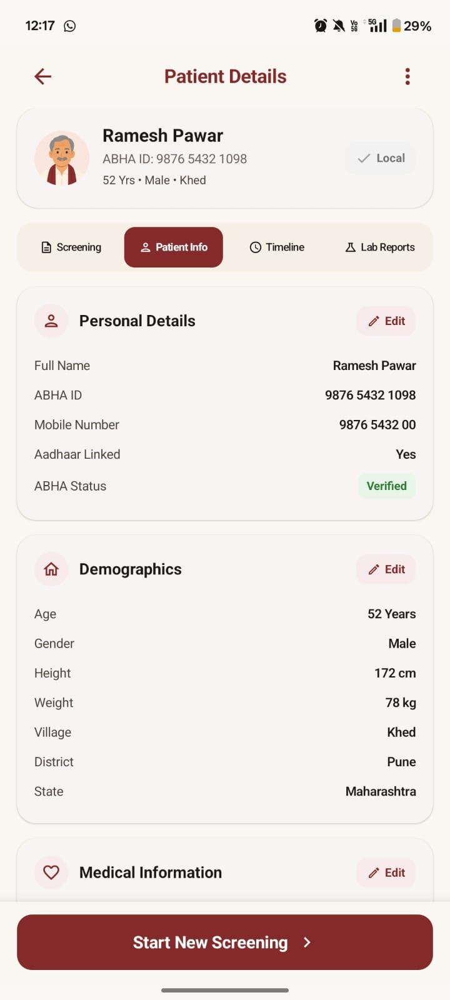 | 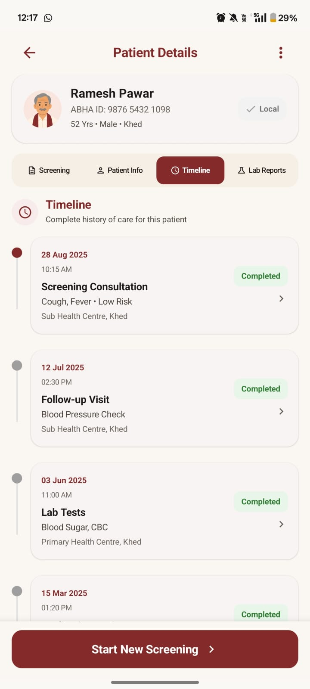 | 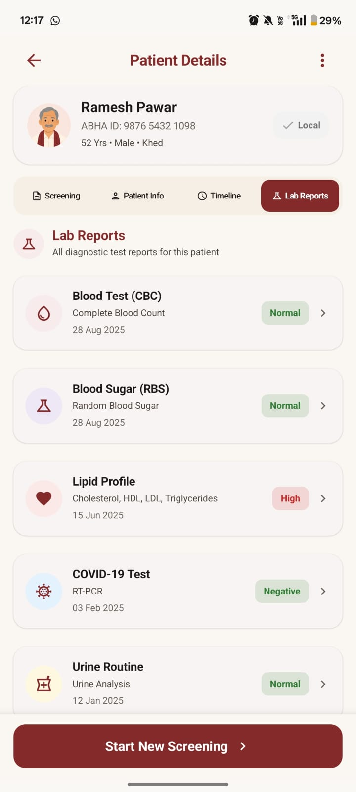 | 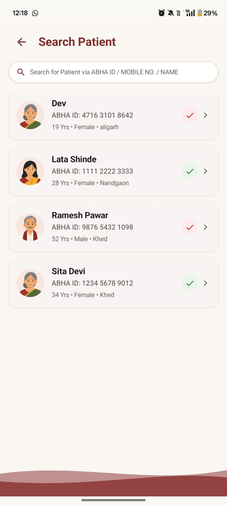 |
| 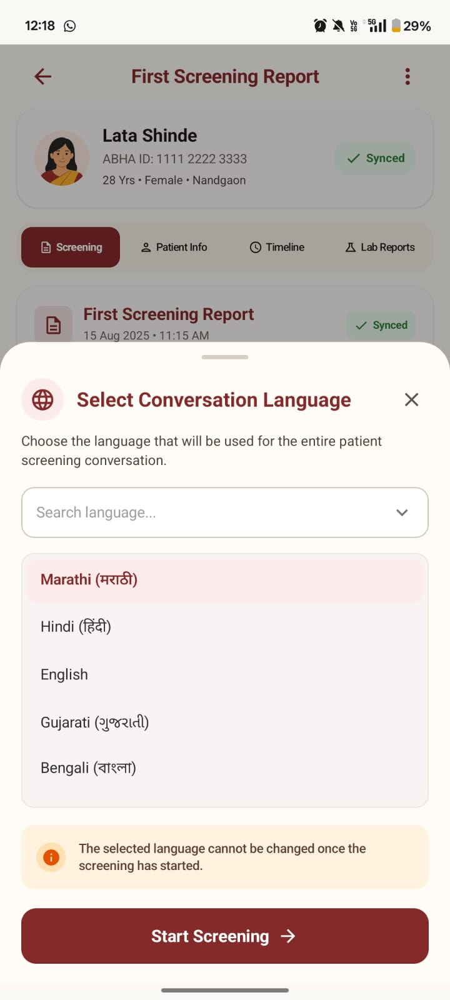 | 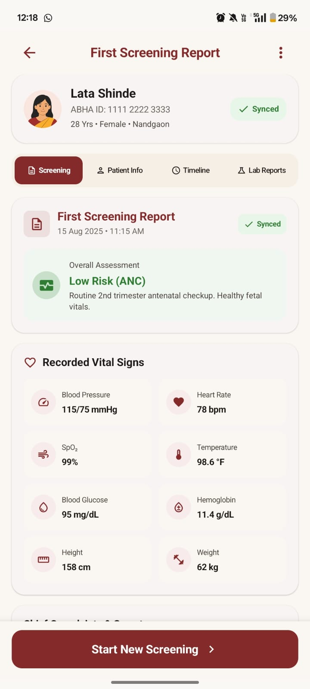 | 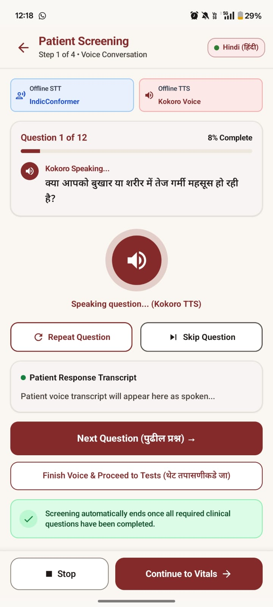 | 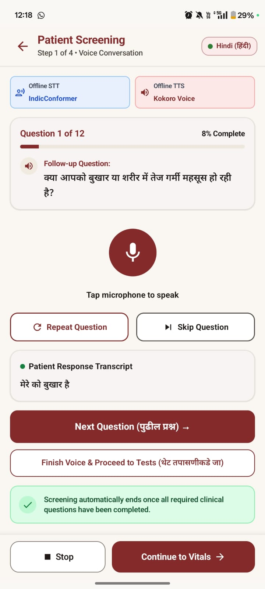 |
| 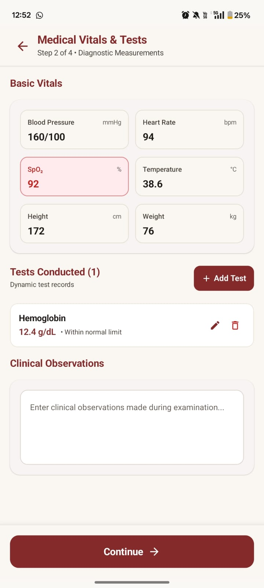 | 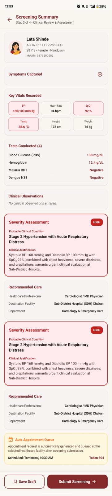 | 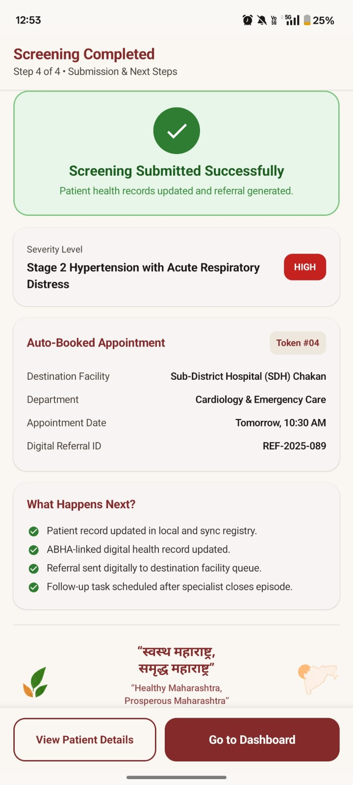 | |

---

## 🌟 Key Features

### 📶 Offline-First Architecture
* Full operational capability in remote areas with low/zero cellular connectivity.
* Room Database handles local persistent storage with encrypted SQLite tables.
* WorkManager background sync automatically pushes unsynced care records when network becomes available.

### 🗣️ Multilingual Voice Assistance (STT & TTS)
* Live Speech-To-Text (STT) transcription for rapid symptom entry during patient intake.
* Text-To-Speech (TTS) readout in **Marathi (mr-IN)**, **Hindi (hi-IN)**, and **English (en-IN)** to assist low-literacy users.

### 🩺 5-Stage Guided Clinical Care Workflow
1. **Patient Search & ABHA Creation**: Search existing profiles or generate instant ABHA via Aadhaar verification.
2. **Symptoms Recording**: Voice or text symptom capture with medical history and current treatments.
3. **Vitals & Diagnostic Tests**: Record Blood Pressure, SpO₂, Glucose, Hemoglobin, Temperature, Malaria, Dengue, and Urine tests.
4. **AI Triage & Severity Matrix**: Automated classification into *Mild, Moderate, Severe,* or *Emergency* severity levels with clinical justification.
5. **Referral & Token Generation**: Digital referral created with queue token, auto-assigned priority, and destination hospital booking.

### 🆔 Interoperable Longitudinal Health Records
* Fully aligned with Ayushman Bharat Digital Mission (ABDM) standards.
* Complete Care Episode history linked across healthcare tiers (Sub-Center ➔ PHC ➔ CHC ➔ District Hospital).

---

## 🏗️ Technical Architecture

SEHAT follows modern Android development practices, emphasizing layered **MVVM architecture**, Unidirectional Data Flow (UDF), and clean code principles.

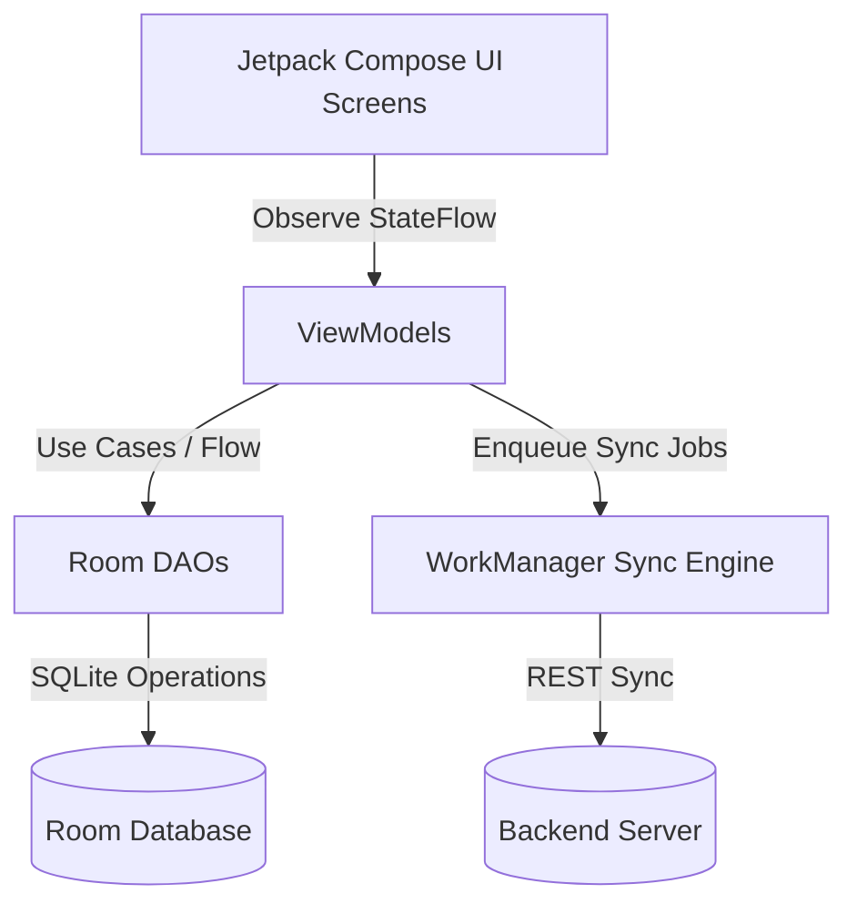

### Tech Stack

* **Language**: Kotlin `2.0.0`
* **Target SDK**: Android 34 (Android 14) / Min SDK 26 (Android 8.0)
* **UI Tooling**: Jetpack Compose (`BOM 2024.06.00`), Material 3 Design Components
* **Local Storage**: Room Database `2.6.1` with KSP code generation
* **Navigation**: Jetpack Navigation Compose `2.7.7`
* **Concurrency**: Kotlin Coroutines & `StateFlow` / `collectAsStateWithLifecycle`
* **Background Processing**: WorkManager `2.9.0`

---

## 🔄 Care Episode Lifecycle

```
[ Patient Intake ] 
       │
       ▼
[ ASHA Home Screening / Sub-Center (AAM-SHC) ]
       │  ├── 1. ABHA Search / Aadhaar Registration
       │  ├── 2. Multilingual Voice Symptoms Capture
       │  ├── 3. Vitals & Rapid Diagnostics Screening
       │  └── 4. Severity Assessment Matrix (Mild / Moderate / Severe / Emergency)
       │
       ▼
[ Automatic Priority Referral & Queue Token ]
       │
       ├──► PHC (Primary Health Center)
       ├──► CHC / FRU (First Referral Unit)
       └──► District Hospital / Medical College
       │
       ▼
[ Doctor Consultation & Discharge ] ──► [ ASHA Follow-up & Recovery Verification ] ──► [ Case Closed ]
```

---

## 🚀 Getting Started

### Prerequisites

* **JDK**: OpenJDK 17 mandatory (`AGP 8.5.2` requires Java 17).
* **Android SDK**: API Level 34 (`Android 14.0`).
* **Gradle**: Gradle 8.9 (Wrapper included).

### Environment Setup (Windows PowerShell)

```powershell
$env:JAVA_HOME = "$env:LOCALAPPDATA\Java\jdk-17.0.20.1+1"
$env:ANDROID_HOME = "$env:LOCALAPPDATA\Android\Sdk"
```

### Build & Run

1. **Clone the repository:**
   ```bash
   git clone https://github.com/saharsh-pathak/SEHAT-app.git
   cd SEHAT-app
   ```

2. **Assemble Debug APK:**
   ```powershell
   .\gradlew.bat assembleDebug
   ```
   *The built APK will be available at `app/build/outputs/apk/debug/app-debug.apk`.*

3. **Install on connected device / emulator:**
   ```bash
   adb install app/build/outputs/apk/debug/app-debug.apk
   ```

4. **Automated Build & Deploy Script:**
   ```powershell
   .\deploy.ps1
   ```

---

## 📂 Project Structure

```
SEHAT-app/
├── app/
│   ├── src/main/java/com/example/sehat/
│   │   ├── data/
│   │   │   ├── dao/          # Patient, Symptom, Vitals, Referral DAOs
│   │   │   ├── entity/       # Room database entities
│   │   │   ├── Converters.kt # TypeConverters for Enums & Lists
│   │   │   └── SehatDatabase.kt
│   │   ├── navigation/       # NavHost & Route definitions (11 screens)
│   │   ├── sync/             # WorkManager sync workers
│   │   ├── ui/
│   │   │   ├── components/   # Reusable Compose widgets
│   │   │   ├── screens/      # Stateless screen composables
│   │   │   └── theme/        # SEHAT color palette & typography
│   │   └── viewmodel/        # Feature ViewModels
│   └── build.gradle.kts
├── UI/                       # Application UI screenshots
├── PRD.md                    # Detailed Product Requirement Document
├── build.gradle.kts
└── settings.gradle.kts
```

---

## 📄 License

This project is developed for **Smart India Hackathon 2026** under **Problem Statement 26133 (Government of Maharashtra)**.
All rights reserved.
